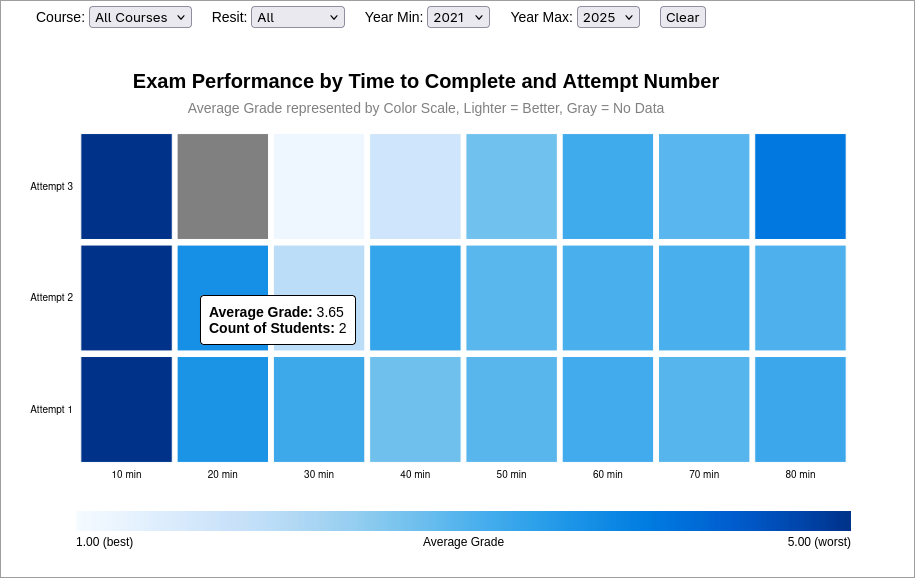

# Bericht

## Teil 1
Es wurde Aufgabe (c) ausgewählt.

## Teil 2
Die Bilder der Entwürfe sind im Verzeichnis `designs/` zu finden.


Es wurden anschliessend Skizze 1 (Scatterplot), Skizze 2 (Heatmap) und Skizze 4 (Boxplot) ausgewählt.

## Teil 3
### Ausarbeitung 1

Beschreibung: Bearbeitungszeit auf der X-Achse, Benotung auf der Y-Achse. Jeder Punkt stellt eine Prüfung dar. Die Anzahl der Versuche wird durch die Farbe (bzw. hier Schraffur/Füllung) dargestellt.

Pro:
- Direkte Darstellung der Beziehung zwischen Bearbeitungszeit und Benotung.
- Outlier sind gut erkennbar.
- Vergleich zwischen Versuchen durch Farbkodierung möglich.
- Kein Aggregationsverlust, da alle Datenpunkte dargestellt werden.

Contra:
- Overplotting kann Mustererkennung erschweren.
- Überlagerung der Punkte bei hoher Dichte.
- Farbkodierung für Versuche kann bei vielen Versuchen unübersichtlich werden.

### Ausarbeitung 2

Beschreibung: Bearbeitungszeit (gebinnt) auf der X-Achse, Anzahl der Versuche auf der Y-Achse. Die Benotung wird durch die Farbskala dargestellt (bzw. hier durch Füllung der Kachel). Hierbei stellt eine heller Farbe bzw. weniger Schraffur eine bessere Benotung dar.

Pro:
- Aggregation reduziert Overplotting.
- Leichte Mustererkennung durch Farbskala.
- Vergleichbarkeit der Attempts, da diese direkt übereinander liegen.
- Schnelle visuelle Informationsaufnahme durch Farbkodierung der Benotung.

Contra:
- Informationsverlust durch Aggregation.
- Outlier werden nicht dargestellt.
- Wahl der Farbskala und Binninggrenzen kann die Interpretation beeinflussen.

### Ausarbeitung 3

Beschreibung: Benotung auf der Y-Achse, Verteilung der Benotung pro Attempt wird nach Minuten gruppiert auf der X-Achse dargestellt. Boxplots zeigen Median, Quartile und Ausreißer.

Pro:
- Zeigt Median, Streuung und Ausreißer der Verteilung pro Attempt.
- Unempfindlich gegenüber Outliern.
- Vergleich der Verteilungen zwischen den Attempts möglich.

Contra:
- Detailverlust durch Aggregation.
- Platzintensiv, da jeder Minutenbin 3 Boxplots benötigt.
- Erschwerte Mustererkennung zwischen Bearbeitungszeit und Benotung.

### Auswahl
Nach Ausarbeitung der Skizzen wurde entschieden, Skizze 2 (Heatmap) zu implementieren.
Gründe für die Auswahl:
- Alle 3 relevanten Dimensionen werden gut erkennbar abgebildet.
- Kein Overplotting, Farbskala und Aggregation der Daten lassen schnelle Interpretation zu.
- Vergleichbarkeit der Attempts, da diese direkt übereinander liegen.
- Leicht Filterbar nach verschiedenen Kriterien, Interaktion möglich.

## Teil 4
Zum Ansehen und Testen der Visualisierung, bitte zunächst README.md beachten. Nachdem alle Abhängigkeiten installiert sind, kann das Projekt lokal gestartet werden.

```bash
npm run dev -- --open
```

Hiernach muss nur noch auf auf die URI `/designuebung` zugegriffen oder im Inhaltsverzeichnis auf den Eintrag "Designübung" geklickt werden, um die Visualisierung zu sehen.



## Teil 5

